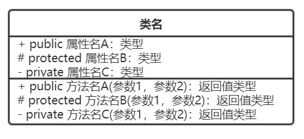
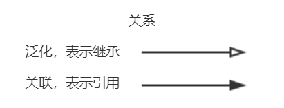
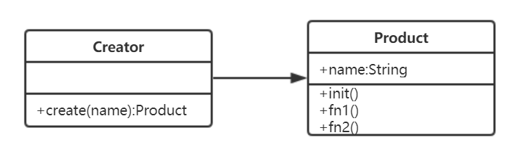
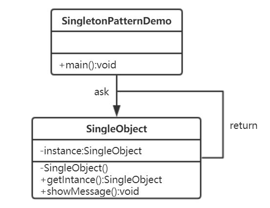

# Javascript 设计模式

这里是本人学习JavaScript设计模式的学习笔记

学习内容：慕课网课程《Javascript 设计模式系统讲解与应用》和书籍《JavaScript设计模式》

另外还有一些其他补充内容，持续更新中

### 面向对象

面向对象三要素：继承、封装、多态

- 封装

  - public 完全开放的   protected 对子类开放的  private 对自己开放的

  - ES6尚不支持封装，可以用typescript（js的超集）来演示
  - 减少耦合
  - 利于数据、接口的权限

- 多态

  - 统一接口，不同表现
  - js应用极少（了解即可）
  - 需要结合java等语言的接口、重写、重载等功能
  - 保持子类的开放性和灵活性
  - 面向接口编程

### UML类图

UML（统一建模语言 Unified Modeling Language）





### 设计

#### 何为设计？

- 即按照哪一种思路或者标准来实现功能
- 功能相同，可能有不同的设计方案来实现
- 伴随着需求增加，设计的作用才能体现出来
- 《UNIX/LINUX设计哲学》

#### 设计准则（《UNIX/LINUX设计哲学》提到的）

准则1：小即是美

准则2：让每个程序只做好一件事

准则3：快速建立原型

准则4：舍弃高效率二取可移植性

准则5：采用纯文本来存储数据

准则6：充分利用软件的杠杆效应（软件复用）

准则7：使用shell脚本来提高杠杆效应和可移植性

准则8：避免强制性的用户界面

准则9：让每个程序都成为过滤器

小准则：

- 允许用户定制环境

- 尽量使操作系统内核小而轻量化

- 使用小写字母并尽量简短

- 沉默是金

- 各部分之和大于整体

- 寻求90%的解决方案

### SOLID五大设计原则

1. S——单一职责原则：一个程序只做好一件事；如果功能过于复杂就拆分开，每个部分保持独立
2. O——开放封闭原则★：对扩展开放，对修改封闭
3. L——李氏置换原则：所有父类能出现的地方，子类都能出现；子类能覆盖父类
4. I——接口独立原则：保持接口的单一独立，避免出现“胖接口”
5. D——依赖倒置原则：面向接口编程，依赖于抽象而不依赖于具体；使用方只关注接口而不关注具体类的实现

### 设计模式

创建型：工厂模式★、单例模式★、原型模式▲

结构型：适配器模式★、装饰器模式★、代理模式★、外观模式★、桥接模式▲、组合模式▲、享元模式▲

行为型：策略模式▲、模板方法模式、观察者模式★、迭代器模式★、职责链模式▲、命令模式▲、备忘录模式▲、状态模式★、访问者模式、中介者模式▲、解释器模式

### 面试中的设计模式

#### 面试真题一

> 打车时，可以打专车或快车，任何车都有车牌号和名称
>
> 不同车价格不同，快车每公里1元，专车每公里2元
>
> 行程开始时，显示车辆信息
>
> 行程结束时，显示打车金额（假定行程就5公里）

1、画UML类图

2、用ES6实现

#### 面试真题二

> 某停车场分三层，每层100车位
>
> 每个车位都能监控到车辆的驶入和离开
>
> 车辆进入前，显示每层的空余车位数量
>
> 车辆进入时，摄像头可识别车牌号和时间
>
> 车辆出来时，出口显示器显示车牌号和停车时间

1、画UML类图

2、用ES6实现

### 工厂模式

**概念**

- 将new单独封装
- 遇到new时，就要考虑是否该使用工厂模式

**UML类图**



**实现**

[实现工厂模式](./src/index1.js)

**使用场景**

- JQuery-$('div')
- React.createElement
- vue异步组件

### 单例模式

**概念**

- 保证一个类仅有一个实例，并提供全局访问
- 单例模式需要用到Java的特性（private）
- 现阶段JavaScript中还没有 private（typescript除外）

**特点**

- 单例类只能有一个实例

- 单例类必须自己创建自己的唯一实例

- 单例类必须给所有其他对象提供这一实例

**主要解决：**一个全局使用的类频繁地创建与销毁。

**UML类图**



**实现**

[实现单例模式](./src/index2.js)：这种方法相对简单，但他增加了这个类的“不透明性”，SingleObject类的使用者必须知道这是一个单例类，跟以往通过new XXX的方式不同，这里需要使用SingleObject.getInstance来获取对象

[透明的单例模式](./src/index3.js)：用户从这个类中创建对象的时候，可以像使用其他任何普通类一样。但是，为了把instance封装起来，使用了自执行的匿名函数和闭包，并且让这个匿名函数返回了真正的Singleton构造方法，这增加了一些程序的复杂度，阅读起来也不是很舒服

[用代理实现单例模式](./src/index4.js)：解决上面的问题，优秀

**惰性单例**

- 惰性单例指的是在需要的时候才创建对象实例

- 惰性单例是单例模式的重点，这种技术在实际开发中非常有用

- 上面的 [实现单例模式](./src/index2.js) 就是这种技术，instance实例对象总是在我们调用SingleObject.getInstance时才被创建，而不是在页面加载好的时候就创建

- [使用惰性单例实现弹框](./src/useCase1.js)

- **通用的惰性单例**

  可以将创建各种对象的方法用参数fn的形式传入getSingle，之后getSingle再返回一个新的函数，并且用一个变量result来保存fn的计算结果

  ```javascript
  var getSingle = function(fn){
      var result;
      return function(){
          return result || (result = fn.apply(this, arguments));
      }
  };
  ```

- [用通用的惰性单例改造前面的弹框](./src/useCase2.js)

**使用场景**

- JQuery只有一个$

  ```js
  if (window.jQuery != null) {
      return window.jQuery
  } else {
      // 初始化...
  }
  ```

- 登录框

  [模拟实现登录框](./src/useCase3.js)

- 购物车

- vuex和redux中的store

- 线程池

- 全局缓存

- 浏览器中的window对象

### 适配器模式

概念

UML类图

实现

使用场景

### 装饰器模式

### 代理模式

### 外观模式

### 观察者模式

### 迭代器模式

### 状态模式

### 其他设计模式

#### 原型模式

#### 桥接模式

#### 组合模式

#### 享元模式

#### 策略模式

#### 模板方法模式和职责链模式

#### 命令模式

#### 备忘录模式

#### 中介者模式

#### 访问者模式和解释器模式
